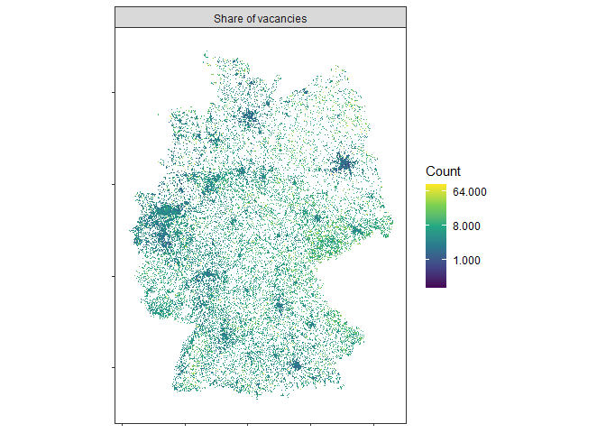

<!-- README.md is generated from README.Rmd. Please edit that file -->

# z22

<!-- badges: start -->

[](https://github.com/JsLth/z22/actions/workflows/R-CMD-check.yaml)
[](https://lifecycle.r-lib.org/articles/stages.html#stable)
[](https://CRAN.R-project.org/package=z22)
[](https://www.repostatus.org/#active)
[](https://app.codecov.io/gh/JsLth/z22?branch=main)
[](https://www.codefactor.io/repository/github/jslth/z22/overview/main)
<!-- badges: end -->

As part of the German census, a number of socio-economic indicators are
published at a small-scale grid level (100m, 1km, 10km). Usually the
corresponding data files are very large and hard to work with. `{z22}`
aims to quickly and efficiently retrieve German census grid data. The
package also eases comparisons to grid data from the census 2011 by
establishing a standardized feature format.

Powered by the [z22data](https://github.com/jslth/z22data) data
repository which hosts the census grid data in small and digestible
chunks. Based on the predecessor package
[z11](https://github.com/stefanjuenger/z11/) which allows easy access to
the gridded data from the Census 2011.

## Installation

You can install the development version of z22 like so:

``` r
pak::pkg_install("jslth/z22")
```

## Example

The package contains a main function, `z22_data`, to retrieve and
process census grid data. The following example downloads a feature grid
on the vacancy share in Germany at a 1x1 km resolution.

``` r
library(z22)
library(terra)
#> terra 1.8.43

grid_vac <- z22_data("vacancies", all_cells = TRUE, rasterize = TRUE)
```

``` r
plot(grid_vac$cat_0)
```



## Available data

| Theme | Name | Description | Zensus22 | Zensus11 (100m) | Zensus11 (1km) |
|:---|:---|:---|:---|:---|:---|
| Population | `population` | Population | ✅ | ✅ | ✅ |
| Population | `citizens` | Number of german citizens, 18 or older | ✅ | ❌ | ❌ |
| Population | `foreigners` | Share of foreigners | ✅ | ❌ | ✅ |
| Population | `foreigners_from_18` | Share of foreigners, 18 or older | ✅ | ❌ | ❌ |
| Population | `birth_country` | Country of birth (groups) | ✅ | ✅ | ❌ |
| Population | `sex` | Sex | ❌ | ✅ | ❌ |
| Population | `women` | Share of women | ❌ | ❌ | ✅ |
| Population | `religion` | Religion | ❌ | ✅ | ❌ |
| Population | `citizenship` | Citizenship | ✅ | ✅ | ❌ |
| Population | `citizenship_group` | Citizenship (groups) | ✅ | ✅ | ❌ |
| Population | `citizenship_origin` | Citizenship by selected countries | ❌ | ✅ | ❌ |
| Population | `citizenship_total` | Number of citizenships | ❌ | ✅ | ❌ |
| Population | `age_avg` | Average age | ✅ | ❌ | ✅ |
| Population | `age_short` | Age (five classes of years) | ✅ | ✅ | ❌ |
| Population | `age_long` | Age (ten years age groups) | ✅ | ✅ | ❌ |
| Population | `age_under_18` | Share of people under 18 | ✅ | ❌ | ✅ |
| Population | `age_from_65` | Share of people 65 or older | ✅ | ❌ | ✅ |
| Population | `marital_status` | Marital status | ✅ | ✅ | ❌ |
| Families | `families` | Total number of families | ✅ | ✅ | ❌ |
| Families | `family_type` | Type of core family (by children) | ✅ | ✅ | ❌ |
| Families | `family_size` | Size of core family | ❌ | ✅ | ❌ |
| Households | `households` | Total number of private households | ✅ | ✅ | ❌ |
| Households | `household_family` | Private households by family types | ❌ | ✅ | ❌ |
| Households | `household_lifestyle` | Private households by lifestyle | ❌ | ✅ | ❌ |
| Households | `household_senior` | Private households by senior status | ❌ | ✅ | ❌ |
| Households | `household_size_avg` | Average household size | ✅ | ❌ | ✅ |
| Households | `household_size_group` | Household size (groups) | ✅ | ✅ | ❌ |
| Dwellings | `dwellings` | Total number of dwellings | ✅ | ✅ | ❌ |
| Dwellings | `rent_avg` | Average net cold rent | ✅ | ❌ | ❌ |
| Dwellings | `dwelling_occupancy` | Use by household occupancy | ❌ | ✅ | ❌ |
| Dwellings | `dwelling_ownership_home` | Ownership of the dwelling | ❌ | ✅ | ❌ |
| Dwellings | `dwelling_ownership_property` | Dwellings by form of ownership | ❌ | ✅ | ❌ |
| Dwellings | `owner_occupier` | Share of owner occupiers | ✅ | ❌ | ❌ |
| Dwellings | `vacancies` | Share of vacancies | ✅ | ❌ | ✅ |
| Dwellings | `market_vacancies` | Share of market active vacancies | ✅ | ❌ | ❌ |
| Dwellings | `inhabitant_space` | Average living space per inhabitant | ✅ | ❌ | ✅ |
| Dwellings | `dwelling_space` | Average living space per dwelling | ✅ | ❌ | ✅ |
| Dwellings | `floor_space` | Floor space of the dwelling (10m² intervals) | ✅ | ✅ | ❌ |
| Dwellings | `dwelling_rooms` | Dwellings by number of rooms | ✅ | ✅ | ❌ |
| Dwellings | `dwelling_constr_year` | Dwellings by construction year (microcensus classes) | ❌ | ✅ | ❌ |
| Dwellings | `dwelling_building_dwellings` | Dwellings by number of dwellings in the building | ❌ | ✅ | ❌ |
| Dwellings | `dwelling_building_size` | Dwellings by building type and size | ✅ | ✅ | ❌ |
| Dwellings | `dwelling_building_type` | Dwellings by residential usage type | ❌ | ✅ | ❌ |
| Dwellings | `dwelling_building_design` | Dwelling by building design | ❌ | ✅ | ❌ |
| Dwellings | `dwelling_heat_type` | Dwellings by predominant heating type | ✅ | ✅ | ❌ |
| Dwellings | `dwelling_heat_src` | Dwellings by energy source of heating | ✅ | ❌ | ❌ |
| Buildings | `buildings` | Total number of buildings | ✅ | ✅ | ❌ |
| Buildings | `building_ownership_property` | Buildings by form of ownership | ❌ | ✅ | ❌ |
| Buildings | `building_constr_year` | Buildings by construction year (microcensus classes) | ✅ | ✅ | ❌ |
| Buildings | `building_dwellings` | Residential buildings by number of dwellings in the building | ✅ | ✅ | ❌ |
| Buildings | `building_size` | Residential buildings by building type and size | ✅ | ✅ | ❌ |
| Buildings | `building_type` | Buildings by residential usage type | ❌ | ✅ | ❌ |
| Buildings | `building_design` | Buildings by building design | ❌ | ✅ | ❌ |
| Buildings | `building_heat_type` | Buildings by predominant heating type | ✅ | ✅ | ❌ |
| Buildings | `building_heat_src` | Buildings by energy source of heating | ✅ | ❌ | ❌ |
