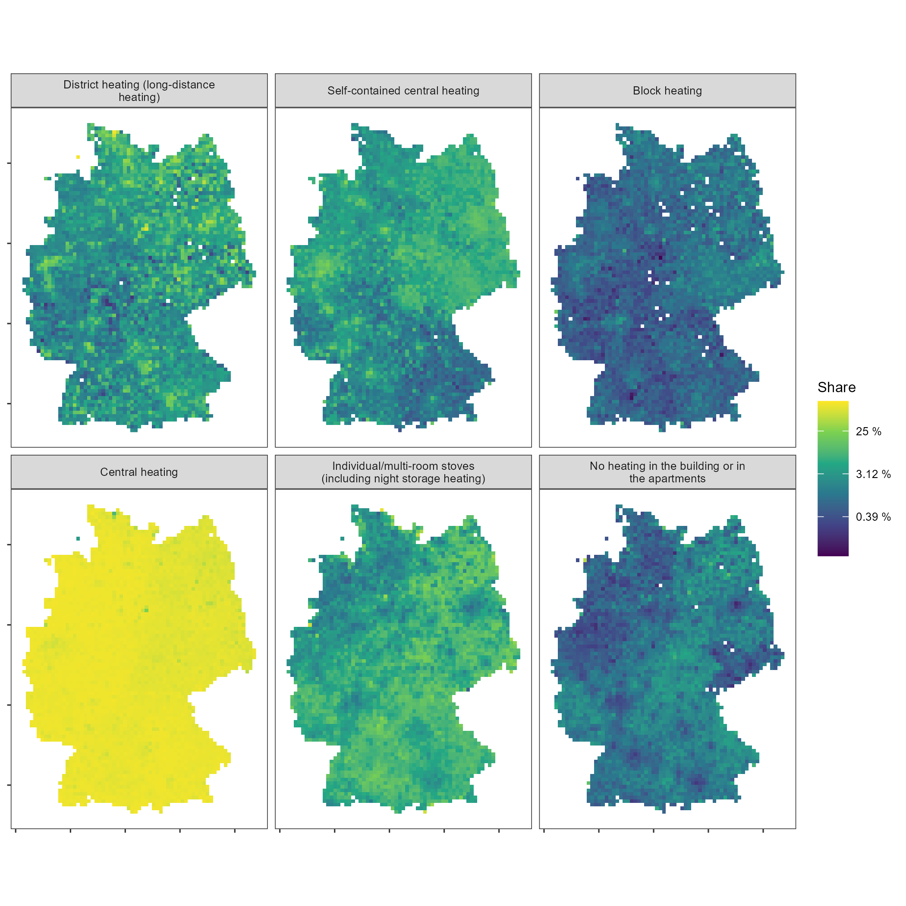
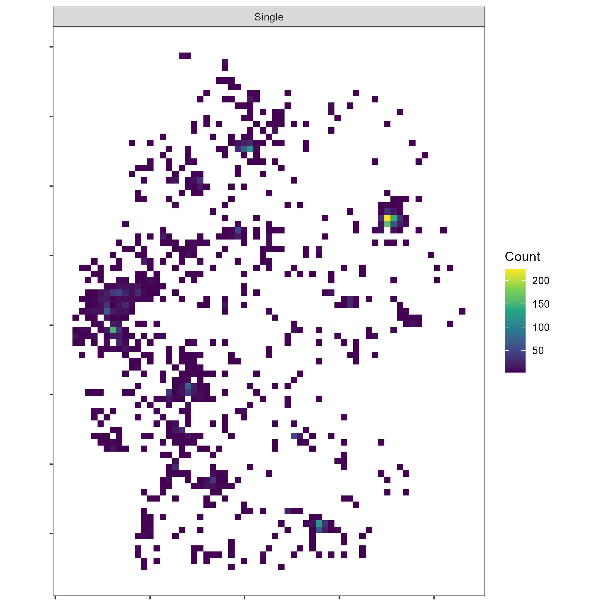
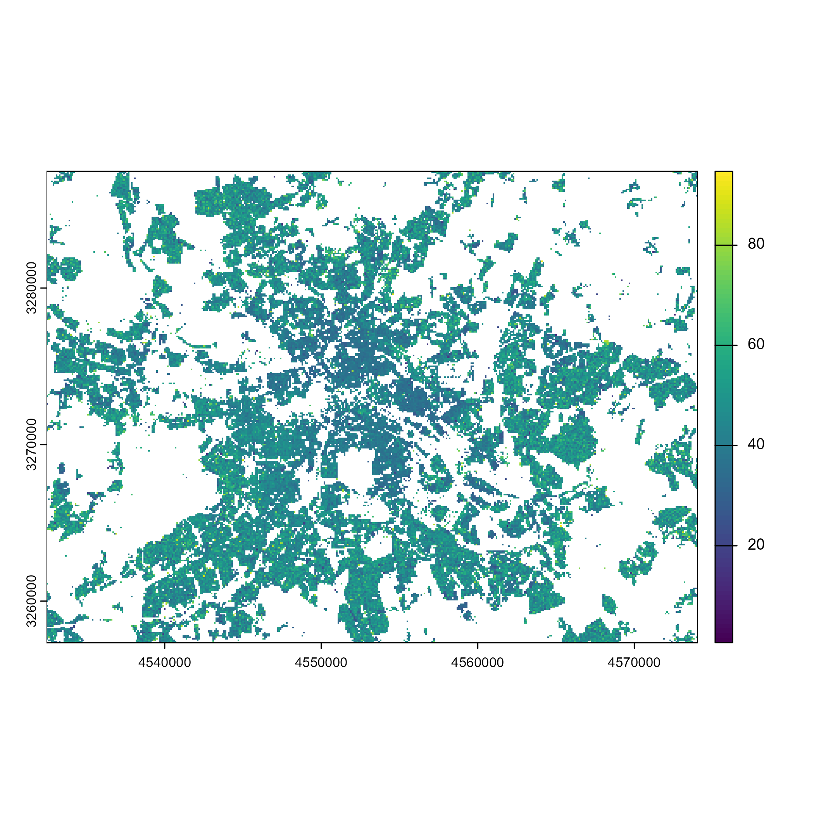

<style>
    img {
        border: none;
    }
</style>


``` r
library(z22)
library(dplyr, warn.conflicts = FALSE)
library(ggplot2)
library(terra)
library(sf)
```

The German [2022 census](https://www.zensus2022.de/) marks the second German census for which spatial census data is published at a grid level. While some progress has been made in the way the data is processed, it is still only available as [CSV dumps](https://www.zensus2022.de/EN/Census_results/). Working with these data programmatically can be quite burdensome. `{z22}` aims to make it easier to read and process census grid data from both 2022 and 2011 censuses. The functions establish a standardized feature language that can translate data from 2011 to 2022, and vice versa. It relies on preprocessed parquet chunks from the [`z22data`](https://github.com/JsLth/z22data/) data repository where the data chunks are stored. The package is a successor of Stefan Jüngers [`z11`](https://stefanjuenger.github.io/z11/) package.

Data chunks are uniquely identified using **features** and **categories**. When I talk about a _feature_, I talk about an indicator aggregated to grid cells, for example, age groups or the number of dwellings. When I talk about a _category_, I talk about the discrete classifications of features, e.g., ages 10 to 19, 20 to 29, 30 to 39, etc. You can retrieve a list of all available features using:


``` r
z22_features()
#> # A tibble: 55 × 8
#>    theme      feature            english                                german                z22   z11_100m z11_1km has_cat
#>    <chr>      <chr>              <chr>                                  <chr>                 <lgl> <lgl>    <lgl>   <lgl>  
#>  1 Population population         Population                             Bevölkerung           TRUE  TRUE     TRUE    FALSE  
#>  2 Population citizens           Number of german citizens, 18 or older Deutsche Staatsangeh… TRUE  FALSE    FALSE   FALSE  
#>  3 Population foreigners         Share of foreigners                    Ausländeranteil       TRUE  FALSE    TRUE    FALSE  
#>  4 Population foreigners_from_18 Share of foreigners, 18 or older       Ausländeranteil ab 1… TRUE  FALSE    FALSE   FALSE  
#>  5 Population birth_country      Country of birth (groups)              Geburtsland (Gruppen) TRUE  TRUE     FALSE   TRUE   
#>  6 Population sex                Sex                                    Geschlecht            FALSE TRUE     FALSE   TRUE   
#>  7 Population women              Share of women                         Frauenanteil          FALSE FALSE    TRUE    FALSE  
#>  8 Population religion           Religion                               Religion              FALSE TRUE     FALSE   TRUE   
#>  9 Population citizenship        Citizenship                            Staatsangehörigkeit   TRUE  TRUE     FALSE   TRUE   
#> 10 Population citizenship_group  Citizenship (groups)                   Staatsangehörigkeit … TRUE  TRUE     FALSE   TRUE   
#> # ℹ 45 more rows
```

Similarly, you can view a list of all categories for a feature.


``` r
z22_categories("birth_country")
#> # A tibble: 6 × 3
#>    code german      english     
#>   <dbl> <chr>       <chr>       
#> 1     1 Deutschland Germany     
#> 2    20 Ausland     Foreign     
#> 3    21 EU27-Land   EU27 country
#> 4    22 Europa      Europe      
#> 5    23 Welt        World       
#> 6    24 Sonstige    Other
```

When I talk about **grids**, I mean a geographical grid net according to the EU [INSPIRE](https://inspire.ec.europa.eu/theme/gg) standard. Grids always have a fixed resolution (100x100 m, 1x1 km, 10x10 km). Such grids are useful to aggregate sensitive spatial data to a relatively detailed level that is not as arbitrary as, e.g., municipality boundaries. You can get a raw grid dataset based on the [GeoGitter](https://gdz.bkg.bund.de/index.php/default/inspire/sonstige-inspire-themen/geographische-gitter-fur-deutschland-in-lambert-projektion-geogitter-inspire.html) dataset using:


``` r
grid <- z22_grid("10km", as = "sf")
```


``` r
plot(grid, pch = 15, cex = 0.5)
```


Although the data chunks are relatively small in size, downloading grids and features again and again can take a while and strain internet tariffs unnecessarily. That's why data files are automatically cached, i.e., if a file is downloaded again, it is simply read from the cache. You can update stale cache files using the `update_cache` argument.

To equip a raw raster with feature values, you can use the `z22_data` function. Here, I download data on the type of heating in buildings across Germany. Using `as = "raster"`, I can convert the output to a `SpatRaster` from the `{terra}` package.


``` r
grid_ht <- z22_data("building_heat_type", res = "10km", as = "raster")
```

After rasterization, the results are returned in a `SpatRasterDataset`, which is essentially a list of `SpatRaster`s. To plot them, you can use the `z22_pivot_longer` function to turn them to a long (and facetable) table.


``` r
df_ht <- z22_pivot_longer(grid_ht, "building_heat_type")
ggplot(df_ht) +
  geom_raster(aes(x, y, fill = value)) +
  facet_wrap(~category, nrow = 2, labeller = label_wrap_gen(width = 35)) +
  coord_sf(crs = 3035) +
  scale_fill_viridis_c("Count", na.value = "transparent", transform = "log2") +
  theme_bw(base_size = 8) +
  labs(x = NULL, y = NULL) +
  theme(panel.grid = element_blank(), axis.text = element_blank())
```


However, as you can see, we are dealing with absolute counts, which makes the meaningfulness of the data questionable on its own. The spatial patterns look very similar in each facet and mostly trace spatial population patterns of Germany. To retrieve normalized (= percentage) figures, we can use the `normalize` argument of `z22_data`. Re-downloading the data should also take much less time because the data files are still cached.


``` r
grid_ht <- z22_data(
  "building_heat_type",
  res = "10km",
  as = "raster",
  normalize = TRUE
)
```

<details><summary>Code for the plot</summary>

``` r
df_ht <- z22_pivot_longer(grid_ht, "building_heat_type")
ggplot(df_ht) +
  geom_raster(aes(x, y, fill = value)) +
  facet_wrap(~category, nrow = 2, labeller = label_wrap_gen(width = 35)) +
  coord_sf(crs = 3035) +
  scale_fill_viridis_c(
    "Share",
    na.value = "transparent",
    transform = "log2",
    labels = \(x) paste(round(x * 100, 2), "%")
  ) +
  theme_bw(base_size = 8) +
  labs(x = NULL, y = NULL) +
  theme(panel.grid = element_blank(), axis.text = element_blank())
```
</details>



By visualizing shares, we can observe that spatial differences are not nearly as pronounced as the total numbers had us believe. Particularly central heating is almost spatially homogeneous. Note that the `normalize` argument is only sensible for features that are counts.

There is one more issue that you can see in the map above. Some cells are `NA` or entirely missing from the dataset and thus not shown at all on the maps. These are cells where no observations can be counted. In the case of heating, the issue is not as pressing but in other cases the feature grid becomes a patchwork. Some marital statuses, for example, are rarely seen in some areas of Germany.


``` r
grid_ht <- z22_data(
  "marital_status",
  categories = 6,
  res = "10km",
  as = "raster"
)
```

<details><summary>Code for the plot</summary>

``` r
df_ht <- z22_pivot_longer(grid_ht, "marital_status")
ggplot(df_ht) +
  geom_raster(aes(x, y, fill = value)) +
  coord_sf(crs = 3035) +
  facet_wrap(~category, nrow = 2) +
  scale_fill_viridis_c("Count", na.value = "transparent") +
  theme_bw() +
  labs(x = NULL, y = NULL) +
  theme(panel.grid = element_blank(), axis.text = element_blank())
```
</details>



To fill these gaps, you can request all cells using the `all_cells` argument.


``` r
grid_ht <- z22_data(
  "marital_status",
  categories = 6,
  res = "10km",
  as = "raster",
  all_cells = TRUE
)
```

<details><summary>Code for the plot</summary>

``` r
df_ht <- z22_pivot_longer(grid_ht, "marital_status")
ggplot(df_ht) +
  geom_raster(aes(x, y, fill = value)) +
  coord_sf(crs = 3035) +
  facet_wrap(~category, nrow = 2) +
  scale_fill_viridis_c("Count", na.value = "transparent") +
  theme_bw() +
  labs(x = NULL, y = NULL) +
  theme(panel.grid = element_blank(), axis.text = element_blank())
```
</details>


Working with 10x10 km grids is cool and all, but the census grids get really exciting when looking at 100x100 m grids. Let's, for example, look at the average age distribution in the area of Berlin.


``` r
grid_age <- z22_data("age_avg", res = "100m", as = "raster", all_cells = TRUE)

ext <- ext(c(4532432, 4574087, 3257338, 3287499))
berlin_age <- crop(grid_age$cat_0, ext)
plot(berlin_age)
```



